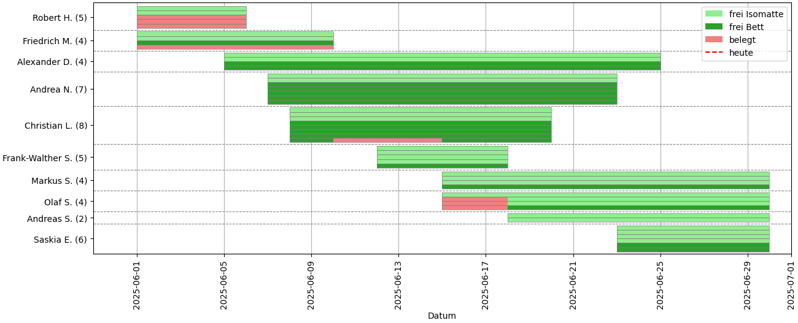
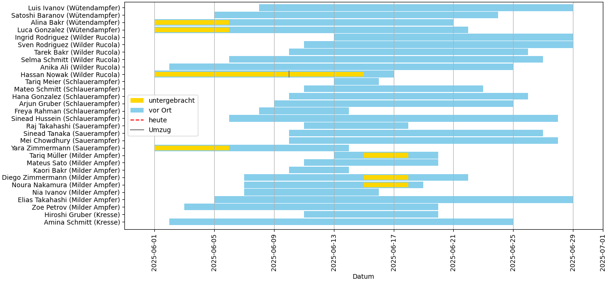
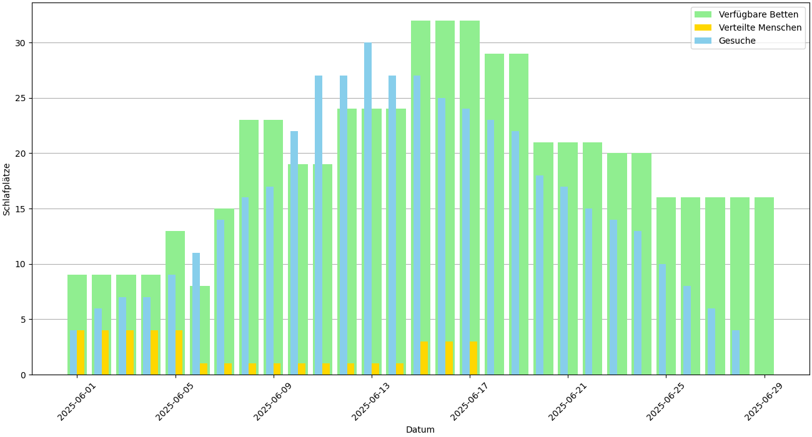

# Bettenbörse

Die Bettenbörse ist ein webbasiertes Tool um Schlafplätze zu organisieren. Die Bettenbörse unterstützt aktuell nur die deutsche Sprache.

## Features

- Formulare für Menschen, die einen Schlafplatz suchen/anbieten (dafür ist kein Account notwendig)
- Menschen koordinieren Schlafplätze und weisen jeder Person eine Unterkunft zu (pro Nacht)
- die Bettenbörse kann Signal-Nachrichten verschicken (als gelinktes Gerät wie am Laptop)

## Demo/Einführung
Ich habe ein kurzes Video gedreht, um die Funktionen zu zeigen. Zum Download: [Demo](/docs/demo.mp4) (die Datei ist leider zu groß, damit sie Github im Browser anzeigt). Ich habe das Video auch auf Youtube gepackt:

[](https://www.youtube.com/watch?v=P-D404GcqIw)

Als visuelle Hilfe bei der Zuteilung von Schlafplätzen gibt es Zeitstrahl-artige Darstellungen der verfügbaren Unterkünte, der Menschen mit Gesuchen und der Auslastung vs. unterzubringende Menschen.







## Getting Started

Die Einstellungen befinden sich in der `settings.py`. Es gibt als Vorlage `settings.py.example`.

#### Starten mit Docker

```
cp bettenboerse/settings.py.example data/bettenboerse/settings.py
vim data/bettenboerse/settings.py
docker-compose up
```

#### Lokal starten

```
poetry install
cp bettenboerse/settings.py.example bettenboerse/settings.py
vim data/bettenboerse/settings.py
poetry run python bettenboerse/app.py
```

Im Browser: http://localhost:5000. Zugangsdaten für den Admin-Bereich: lg:lg

Für das Formular zum Suchen von Schlafplätzen: http://localhost:5000/suche-schlafplatz

### Tests

Um die Tests laufen zu lassen:

```poetry run pytest tests
poetry run pytest tests
```

## Kontakt

Die Bettenbörse ist gerade stark angepasst an spezielle Bedürfnisse. Ich hätte Lust, sie zu verallgemeinern und für alle nutzbar(er) zu machen. Aber nur, wenn sie auch wirklich genutzt wird. Melde dich einfach per Mail: bpx4ps77ti1tw14gh6y0gh57@systemli.org
